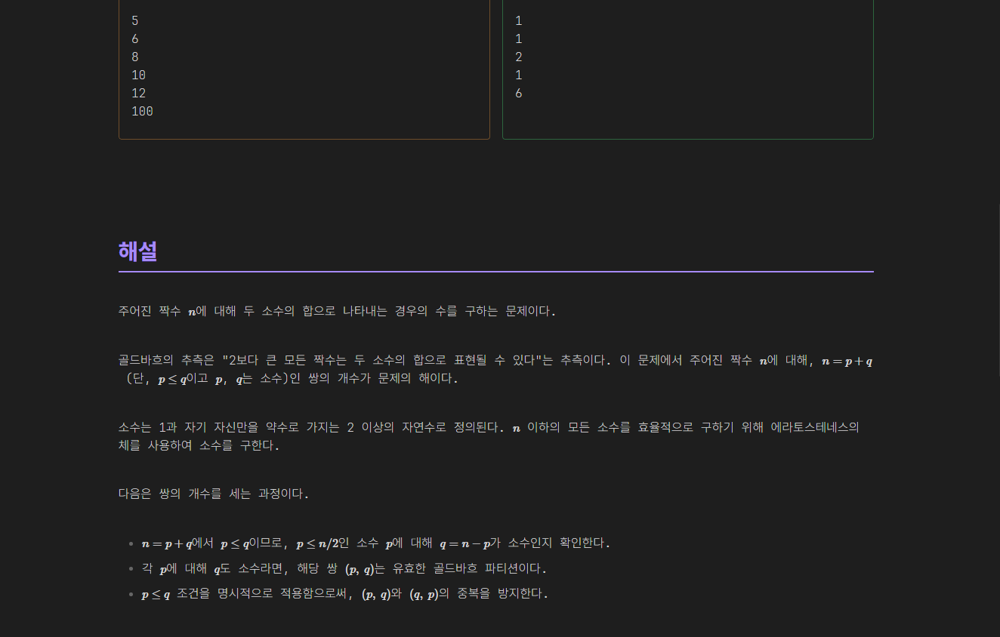

# 유니티 강의 관련

어제 못다한 3-5주차 강의를 모두 들었습니다. 유니티 프로젝트에 손을 놓은지 조금 오래되어 진행하는데 어려움이 있을 것이라 생각했습니다. 다행히 개인 프로젝트를 몇 번 진행한 경험이 있어 강의를 듣는데는 어려움이 없었습니다. 다음에 진행될 팀 프로젝트가 매우 기대가 되면서 강의를 마무리 지었습니다.

# BOJ 정리 관련

예전에 풀었던 문제들을 다시 복습하고 있습니다. 정리가 미흡한 점이 많아 가나다 순으로 정리하는데도 시간이 많이 소요가 되었습니다. 조금은 요령이 생긴 것 같아 내일은 더 많은 양의 문제를 정리할 수 있을 것 같습니다.
