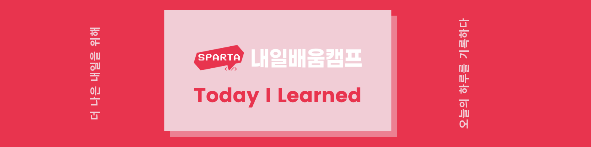
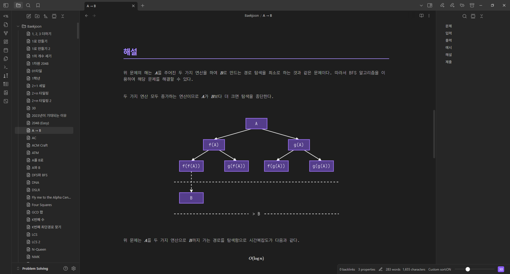
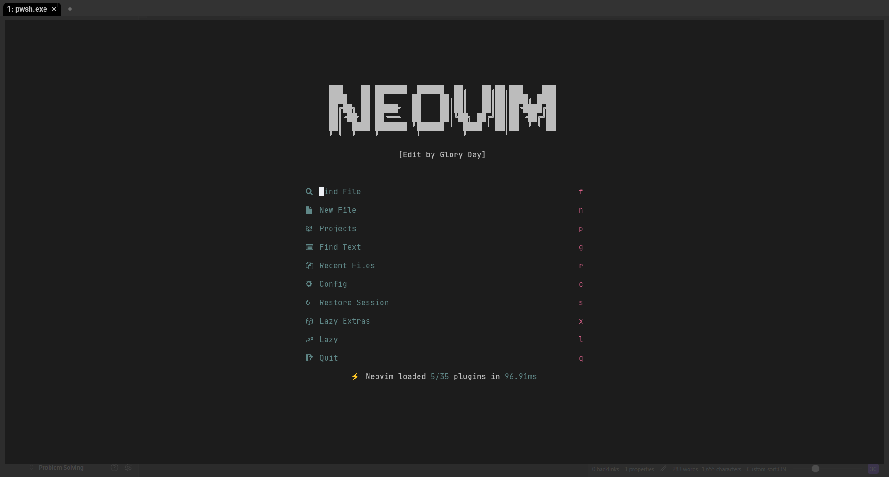
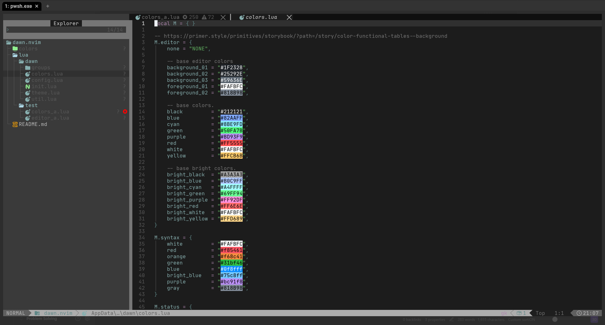

# 스파르타 코딩 교육

### 팀 프로젝트 발표

금일 타 팀들의 팀 프로젝트 발표를 들었습니다. 한 가지 주제(카드 맞추기)를 가지고 여러 가지의 게임들을 제작을 하셔서 발표를 하셨는데, 생각보다 많은 다양성을 주신 모습들을 보고 많은 생각이 들었습니다. 2주 뒤에 진행될 팀 프로젝트에서 어떤 식으로 방향을 잡아야 할지 생각이 많은 세션이였습니다.

### TIL 강의

TIL 강의를 들으며 TIL 작성의 중요성에 대해 개인적인 과거가 상기되었습니다. 많은 프로젝트와 많은 문제를 풀고 많은 학습을 했음에도 불구하고 정리를 하지 않으면 남에게 증명도 안될 뿐더러 복습의 의미도 사라지기 때문입니다. 따라서 예전에 작성했던 TIL 형식과는 조금 다른 형식으로 문서를 작성하였습니다. 앞으로 더 나아질 것입니다.

# 개인 학습

### BOJ 문제 정리

현재 특수문자, 'ㄱ', 'ㄴ'까지 정리하였습니다. 'ㄷ' 문제가 많지만 빠르게 정리할 것입니다.

### LazyVim 설정

예전에 쓰던 테마가 별로 마음에 들지 않아 테마를 직접 제작하기로 했습니다. 현재 설정까지 맞춘 상태이고 앞으로 "highlight", "syntax" 및 플러그인 색상 매칭이 남았습니다.
