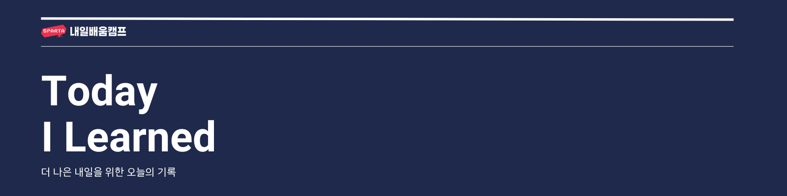
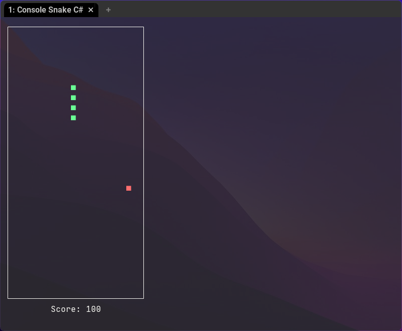
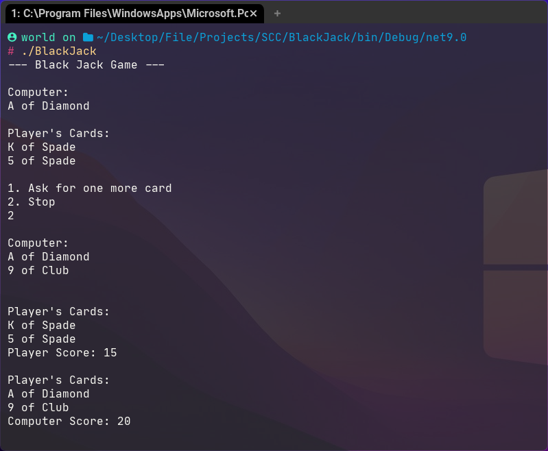

# 스파르타 코딩 교육

### C# 기본 문법

C# 기본 문법 중 하나인 변수와 구조체의 사용법에 대한 강의와 프로그래머스 관련 온라인 문제 풀이 사이트에 대한 설명을 들었습니다.

# 개인 학습

### C# 기본 문법 숙제

오늘 스네이크 게임과 블랙잭 게임을 콘솔 환경에서 구현해보았습니다. 블랙잭은 크게 어렵지 않았지만 스네이크 게임 같은 경우 콘솔의 깜빡거림 현상을 없애기 위한 뱀의 위치 갱신 부분이 조금 애를 먹었습니다. 
