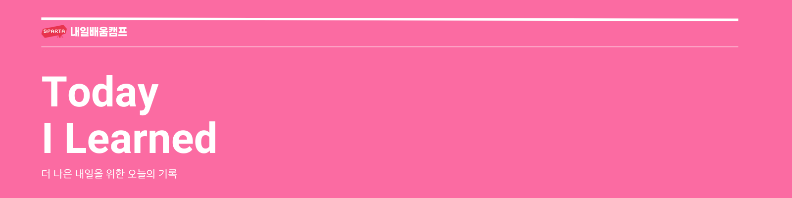

# 스파르타 코딩 교육

### C# 기초 문법 강의

금일 반복문에 대해서 강의를 들었습니다.

# 개인 학습

### 개인 과제 프로젝트

프로젝트 "Rtan RPG" 과제가 오늘부로 종료되었습니다. 앞서 여러 가지 레이아웃 구성 로직 구현에 시간을 많이 허비한 나머지 필수 구현부 및 선택 구현부 부분을 일부 구현하지 못했습니다. 아직 해결하지 못한 부분이 있지만 조금씩 완성시켜 나갈 예정입니다.
