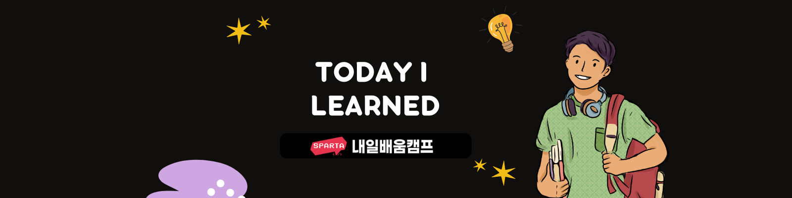

# 스파르타 코딩 교육

### C# 기초 문법 강의

금일 문자열에 대해서 강의를 들었습니다.

### Git 강의

브랜치 관련, Commit 룰 및 전략에 대해서 강의를 들었습니다.

# 팀 학습

### 팀 과제 프로젝트

프로젝트 "Rtan RPG" 과제를 바탕으로 새로운 기능을 추가하여 개발하는 팀 프로젝트를 시작하는 날입니다. 오늘은 API 설계 및 역할 분담을 하였습니다.
